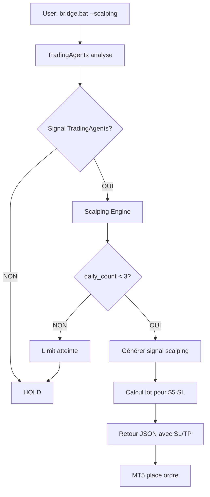

# Guide Mode Scalping TradBOT

## 🎯 Objectif

Le **Mode Scalping** est conçu pour les traders avec **petit capital ($10-20)** qui souhaitent faire du scalping sur l'or (XAUUSD) ou autres actifs avec :

- **SL fixe** : $5 maximum par trade
- **TP cible** : $10-15 (R:R 2:1 à 3:1)
- **Max 3 trades/jour** (limite stricte)
- **Win rate cible** : 66%+ (2/3 trades gagnants)

---

## 📊 Caractéristiques

### Dimensionnement Automatique

Le système calcule automatiquement le **lot size** pour risquer exactement $5 :

```
Exemple XAUUSD @ $2500 :
- Capital : $20
- Risque : $5 (25% du capital)
- SL distance : 50 pips (5 points)
- Lot calculé : 0.01 (micro-lot)
- TP1 : +10 points ($10)
- TP2 : +15 points ($15)
```

### Signaux Filtrés

Le système génère **max 3 signaux par jour** basés sur :

1. **Support/Resistance** : Prix proche d'une zone clé
2. **Trend alignment** : EMA H1 confirme la direction
3. **Confluence TradingAgents** : Bonus +15% confiance si aligné

---

## 🚀 Utilisation

### 1. Via API `/decision`

Ajouter `scalping_mode=true` dans la requête POST :

```bash
curl -X POST http://127.0.0.1:8000/decision \
  -H "Content-Type: application/json" \
  -d '{
    "symbol": "XAUUSD",
    "bid": 2500.5,
    "ask": 2500.7,
    "rsi": 45,
    "ema_fast_h1": 2501.0,
    "ema_slow_h1": 2499.0,
    "atr": 3.5,
    "scalping_mode": true,
    "capital_usd": 20.0,
    "chart_levels": {
      "support": 2500.0,
      "resistance": 2520.0
    }
  }'
```

**Réponse attendue** :

```json
{
  "action": "buy",
  "confidence": 0.75,
  "reason": "SCALPING: Prix @ support $2500.00; Trend: bullish; TradingAgents: BUY 70%",
  "stop_loss": 2495.0,
  "take_profit": 2510.0,
  "model_used": "Scalping+Multi-TF",
  "metadata": {
    "scalping_mode": true,
    "scalp_signal": {
      "symbol": "XAUUSD",
      "direction": "BUY",
      "entry_price": 2500.6,
      "stop_loss": 2495.6,
      "take_profit_1": 2510.6,
      "take_profit_2": 2515.6,
      "lot_size": 0.01,
      "risk_usd": 5.0,
      "reward_usd": 12.5,
      "risk_reward": 2.5,
      "confidence": 0.75,
      "setup_type": "support_bounce"
    },
    "daily_count": 1,
    "max_daily": 3
  }
}
```

---

### 2. Via Bridge TradingAgents

**Option 1 : Mode scalping direct**

```bash
.\bridge.bat --symbol XAUUSD --scalping --capital 20
```

**Option 2 : Convertir rapport TradingAgents en scalping**

```bash
.\bridge.bat --symbol XAUUSD --scalping-report
```

Le bridge génère alors un rapport avec :
- Analyse globale TradingAgents (swing)
- **+ 3 signaux scalping** dimensionnés pour $5 SL

---

### 3. Rapport Quotidien

Consulter les signaux générés aujourd'hui :

```bash
curl http://127.0.0.1:8000/scalping/report
```

**Réponse** :

```json
{
  "status": "OK",
  "daily_count": 2,
  "max_daily": 3,
  "remaining": 1,
  "signals": [
    {
      "symbol": "XAUUSD",
      "direction": "BUY",
      "entry_price": 2500.6,
      "stop_loss": 2495.6,
      "take_profit_1": 2510.6,
      "take_profit_2": 2515.6,
      "lot_size": 0.01,
      "confidence": 0.75,
      "timestamp": "2026-05-25T16:30:00.123456"
    },
    {
      "symbol": "XAUUSD",
      "direction": "SELL",
      "entry_price": 2519.8,
      "stop_loss": 2524.8,
      "take_profit_1": 2509.8,
      "take_profit_2": 2504.8,
      "lot_size": 0.01,
      "confidence": 0.72,
      "timestamp": "2026-05-25T18:45:00.654321"
    }
  ],
  "report_markdown": "..."
}
```

---

## 📐 Calcul du Lot Size

### Formule

```
lot = risk_usd / (sl_distance_pips * pip_value_per_lot)
```

### Exemple XAUUSD

```
Capital     : $20
Risque      : $5 (25%)
Entry       : 2500.00
SL          : 2495.00
Distance    : 5.0 points = 50 pips
Pip value   : $0.01 per pip @ 0.01 lot
            = $1.00 per pip @ 1.0 lot

lot = 5.0 / (50 * 0.01 * 100)
    = 5.0 / 50
    = 0.10 lot

→ Arrondi à 0.01 (min micro-lot)
```

### Exemple BTCUSD

```
Capital     : $20
Risque      : $5
Entry       : 50000
SL          : 49950
Distance    : 50 points
Pip value   : $0.01 per point @ 0.01 lot

lot = 5.0 / (50 * 0.01 * 100)
    = 0.10 lot
→ Arrondi à 0.01
```

---

## ⚙️ Configuration MT5

### Paramètres EA

Ajouter dans `SMC_Universal.mq5` :

```mql5
// === SCALPING MODE ===
input bool   UseScalpingMode = false;       // Activer mode scalping
input double ScalpingCapital = 20.0;        // Capital scalping en $
input int    MaxScalpingTradesPerDay = 3;  // Max trades/jour
```

### Logique d'appel

```mql5
if(UseScalpingMode)
{
   // Construire payload JSON avec scalping_mode=true
   string json = StringFormat(
      "{\"symbol\":\"%s\",\"bid\":%.5f,\"ask\":%.5f,"
      "\"rsi\":%.2f,\"ema_fast_h1\":%.5f,\"ema_slow_h1\":%.5f,"
      "\"atr\":%.5f,\"scalping_mode\":true,\"capital_usd\":%.2f}",
      _Symbol, Bid, Ask, g_rsi, g_ema_fast_h1, g_ema_slow_h1,
      g_atr, ScalpingCapital
   );

   // Envoyer POST /decision
   string response = SendHTTPRequest(AI_SERVER_URL + "/decision", json);

   // Parser réponse
   // Si action != "hold" → placer ordre micro-lot
}
```

---

## 📊 Tracking Performance

### Métriques Cibles

| Métrique | Cible | Alerte si |
|----------|-------|-----------|
| Win rate | 66%+ | < 50% |
| Avg win | $12.5 | < $10 |
| Avg loss | -$5.0 | > -$6 |
| Max DD | 25% | > 40% |
| Trades/jour | 3 max | > 3 |

### Logs

Les signaux sont logués dans :
- `ai_server.log` : Génération signaux
- `POST /decision/accuracy` : Résultats réels

---

## 🛡️ Protections

### 1. Limit Quotidien

```python
if get_daily_signal_count() >= 3:
    return None  # Pas de nouveau signal
```

### 2. Capital Minimum

```python
if capital_usd < 10.0:
    raise ValueError("Capital min $10 requis pour scalping")
```

### 3. Spread Check

```python
if (ask - bid) > atr * 0.3:
    logger.warning("Spread trop large pour scalping")
    return None
```

---

## 🔄 Workflow Complet



---

## 📝 TODO / Améliorations Futures

- [ ] Intégration GrowthBook A/B testing pour optimiser setups
- [ ] Machine Learning pour prédire win rate par setup type
- [ ] Backtesting simulateur avec historique 2022-2024
- [ ] Dashboard temps réel des 3 signaux du jour
- [ ] Notifications Telegram/Discord pour nouveaux signaux

---

## 🆘 Troubleshooting

### Problème : "Scalping Engine non disponible"

**Solution** :
```bash
# Vérifier que scalping_engine.py est dans Python/
cd D:\Dev\TradBOT\Python
ls scalping_engine.py

# Relancer serveur AI
python ai_server.py
```

### Problème : "Pas de signal scalping valide"

**Causes possibles** :
1. Limit 3/jour atteinte → Attendre minuit UTC
2. Prix pas proche support/resistance
3. Trend neutre sans confluence TradingAgents

**Debug** :
```bash
curl http://127.0.0.1:8000/scalping/report
# Vérifier daily_count
```

### Problème : "Lot size = 0.01 mais perte > $5"

**Cause** : Spread trop large ou slippage

**Solution** :
- Vérifier spread actuel : `(ask - bid)`
- Trader uniquement pendant London/NY session
- Éviter news events (NFP, CPI, FOMC)

---

## 📞 Support

Pour toute question ou bug report :
- GitHub Issues : [TradBOT Issues](https://github.com/user/tradbot/issues)
- Discord : `#scalping-mode`
- Email : support@tradbot.ai

---

**Version** : 1.0.0  
**Dernière mise à jour** : 2026-05-25  
**Auteur** : TradBOT Dev Team
